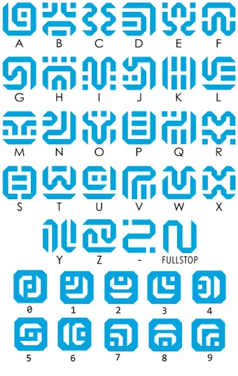

Cryptography
-----------------

* Cryptii

	[https://cryptii.com](https://cryptii.com) has multiple decoding tools like base64, Ceaser Cipher, ROT13, Vigenère Cipher and more.
* Keyboard Shift

	[https://www.dcode.fr/keyboard-shift-cipher](https://www.dcode.fr/keyboard-shift-cipher) If you see any thing that has the shape of a sentence but it looks like nonsense letters, and notes some shift left or right, it may be a keyboard shift...

* Bit Shift

	Sometimes the letters may be shifted by a stated hint, like a binary bit shift ( x >> 1 ) or ( x << 1 ).

* Reversed Text

	Sometimes a "ciphertext" is just as easy as reversed text. Don't forgot to check under this rock! You can reverse a string in [Python] like so:

```
"UOYMORFEDIHOTGNIYRTEBTHGIMFTCA.TAHTTERCESASISIHT"[::-1]
```

* XOR

	ANY text could be XOR'd. Techniques for this are Trey's code, and XORing the data against the known flag format. Typically it is given in just hex, but once it is decoded into raw binary data, it gives it keeps it's hex form (as in `\xde\xad\xbe\xef` etc..) Note that you can do easy XOR locally with Python like so (you need `pwntools` installed):

	``` python
	python >>> import pwn; pwn.xor("KEY", "RAW_BINARY_CIPHER")
	```

# IF YOU KNOW A DECENT CRIB (PLAINTEXT), USE CYBERCHEF TO HELP DETERMINE THE KEY

# DO NOT FORGET TO JUST BRUTEFORCE JUST THE FIRST BYTE, OR TWO BYTES OR THREE BYTES.


* Caesar Cipher

	The most classic shift cipher. Tons of online tools like this: [https://www.dcode.fr/caesar-cipher](https://www.dcode.fr/caesar-cipher) or use `caesar` as a command-line tool (`sudo apt install bsdgames`) and you can supply a key for it. Here's a one liner to try all letter positions:

	```
	cipher='jeoi{geiwev_gmtliv_ws_svmkmrep}' ; for i in {0..25}; do echo $cipher | caesar $i; done
	```

	__Be aware!__ Some challenges include punctuation in their shift! If this is the case, try to a shift within all 255 ASCII characters, not just 26 alphabetical letters!

* `caesar`

	A command-line caesar cipher tool (noted above) found in the `bsdgames` package.

* [Atbash Cipher]

	If you have some text that you have no idea what it is, try the [Atbash cipher]! It's a letter mapping, but the alphabet is reversed: like `A` maps to `Z`, `B` maps to `Y` and so on. There are tons of online tools to do this ([http://rumkin.com/tools/cipher/atbash.php](http://rumkin.com/tools/cipher/atbash.php)), and you can build it with [Python].

* [Vigenere Cipher]

	[http://www.mygeocachingprofile.com/codebreaker.vigenerecipher.aspx](http://www.mygeocachingprofile.com/codebreaker.vigenerecipher.aspx), [https://www.guballa.de/vigenere-solver](https://www.guballa.de/vigenere-solver) and personal Python code here: [https://pastebin.com/2Vr29g6J](https://pastebin.com/2Vr29g6J)


* Gronsfeld Cipher

	A variant of the Vignere cipher that uses numbers insteads of letters. [http://rumkin.com/tools/cipher/gronsfeld.php](http://rumkin.com/tools/cipher/gronsfeld.php)

* Beaufourt Cipher

	[https://www.dcode.fr/beaufort-cipher](https://www.dcode.fr/beaufort-cipher)

* [Bacon Cipher](https://en.wikipedia.org/wiki/Bacon%27s_cipher)

	A substitution cipher that replaces each character with five characters from a set of two (A and B is used most of the time). If we look at A as 0 and B as 1 it is a special encoding to binary numbers, where the character A has the value of binary `b00000`. Easy to recognize, because the ciphertext only contains two characters (e.g.: A and B) and the length of the ciphertext is divisible by 5. Example: `AAABB AAABA ABBAB AAABB AABAA AAAAB AAAAA AAABA ABBAB ABBAA`.

        [Online tool](http://rumkin.com/tools/cipher/baconian.php)

* Python random module cracker/predictor

	[https://github.com/tna0y/Python-random-module-cracker](https://github.com/tna0y/Python-random-module-cracker)... helps attack the Mersenne Twister used in Python's random module.

* Transposition Cipher

* RSA: Classic RSA

	Variables typically given: `n`, `c`, `e`. _ALWAYS_ try and give to [http://factordb.com](http://factordb.com). If `p` and `q` are able to be determined, use some RSA decryptor; handmade code available here: [https://pastebin.com/ERAMhJ1v](https://pastebin.com/ERAMhJ1v)

* RSA: Multi-prime RSA

	When you see multi-prime RSA, you can use calculate `phi` by still using all the factors.

```
phi = (a - 1) * (b - 1) * (c - 1)    # ... etcetera
```

__If FactorDB cannot find factors, try alpertron: [https://www.alpertron.com.ar/ECM.HTM](https://www.alpertron.com.ar/ECM.HTM)__


* RSA: `e` is 3 (or small)

	If `e` is 3, you can try the cubed-root attack. If you the cubed root of `c`, and if that is smaller than the cubed root of `n`, then your plaintext message `m` is just the cubed root of `c`! Here is [Python] code to take the cubed root:

```
def root3rd(x):
    y, y1 = None, 2
    while y!=y1:
        y = y1
        y3 = y**3
        d = (2*y3+x)
        y1 = (y*(y3+2*x)+d//2)//d
    return y
```

* RSA: Wiener's Little D Attack

	The telltale sign for this kind of challenge is an enormously large `e` value. Typically `e` is either 65537 (0x10001) or `3` (like for a Chinese Remainder Theorem challenge). Some stolen code available here: [https://pastebin.com/VKjYsDqD](https://pastebin.com/VKjYsDqD)

* RSA:  Boneh-Durfee Attack
	The tellgate sign for this kind of challenge is also an enormously large `e` value (`e` and `n` have similar size).
Some code for this attack can be found [here](https://github.com/mimoo/RSA-and-LLL-attacks/blob/master/boneh_durfee.sage)

* RSA: Chinese Remainder Attack

	These challenges can be spotted when given  mutiple `c` cipher texts and multiple `n` moduli. `e` must be the same number of given `c` and `n` pairs. Some handmade code here: [https://pastebin.com/qypwc6wH](https://pastebin.com/qypwc6wH)

* [LC4]

	This is an adaptation of RC4... just not. There is an implementation available in Python.
	[https://github.com/dstein64/LC4/blob/master/documentation.md](https://github.com/dstein64/LC4/blob/master/documentation.md)

* Elgamal

* Affine Cipher

* Substitution Cipher (use quip quip!)

	[https://quipqiup.com/](https://quipqiup.com/)

* Railfence Cipher

	[http://rumkin.com/tools/cipher/railfence.php](http://rumkin.com/tools/cipher/railfence.php)


* [Playfair Cipher]

	racker: [http://bionsgadgets.appspot.com/ww_forms/playfair_ph_web_worker3.html](http://bionsgadgets.appspot.com/ww_forms/playfair_ph_web_worker3.html)

* Polybius Square

	[https://www.braingle.com/brainteasers/codes/polybius.php](https://www.braingle.com/brainteasers/codes/polybius.php)

* The Engima

	[http://enigma.louisedade.co.uk/enigma.html](http://enigma.louisedade.co.uk/enigma.html),
	[https://www.dcode.fr/enigma-machine-cipher](https://www.dcode.fr/enigma-machine-cipher)

* AES ECB

	The "blind SQL" of cryptography... leak the flag out by testing for characters just one byte away from the block length.


* Two-Time Pad

* [International Code of Signals Maritime]

	First drafted by the British Board of Trade in 1855 and adopted as a world-wide standard on 1 January 1901. It is used for communications with ships, but also occasionally used by geocaching mystery caches (puzzle caches), CTFs and various logic puzzles. You may want to give a look at the tool [maritime flags translator].


* Daggers Cipher

The daggers cipher is another silly text-to-image encoder. This is the key, and you can
find a decoder on [https://www.dcode.fr/daggers-alphabet](https://www.dcode.fr/daggers-alphabet).


* Hylian Language (Twilight Princess)

The Hylian language is another silly text-to-image encoder. This is the key, and you can
find a decoder on [https://www.dcode.fr/hylian-language-twilight-princess](https://www.dcode.fr/hylian-language-twilight-princess).


* Hylian Language (Breath of the Wild)

The Hylian language is another silly text-to-image encoder. This is the key, and you can
find a decoder on [https://www.dcode.fr/hylian-language-breath-of-the-wild](https://www.dcode.fr/hylian-language-breath-of-the-wild).


* Sheikah Language (Breathe of the Wild)

The Sheikah language is another silly text-to-image encoder. This is the key, and you can
find a decoder on [https://www.dcode.fr/sheikah-language](https://www.dcode.fr/sheikah-language).



* Hexahue Alphabet 

The hexhue is an another tex-to-image enocder. you can find a decoder
on [https://www.boxentriq.com/code-breaking/hexahue](https://www.boxentriq.com/code-breaking/hexahue)


