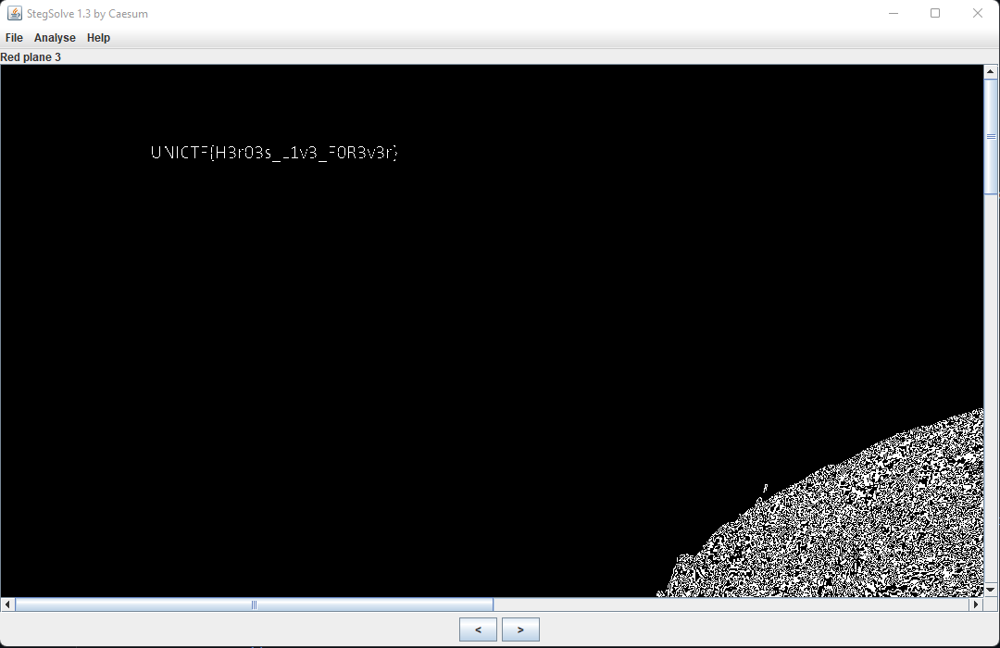
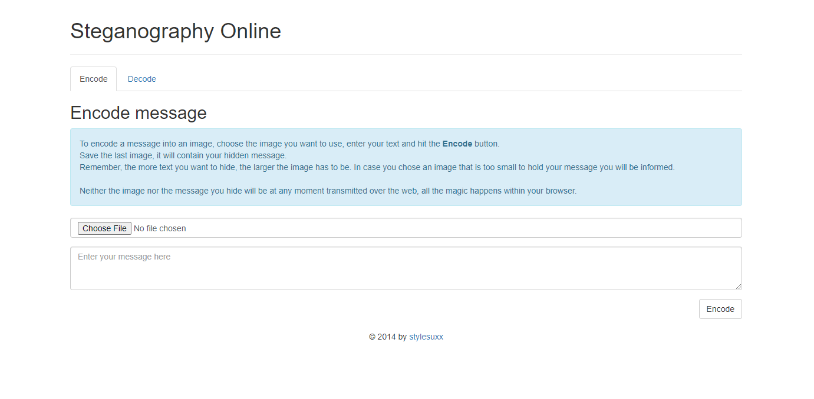
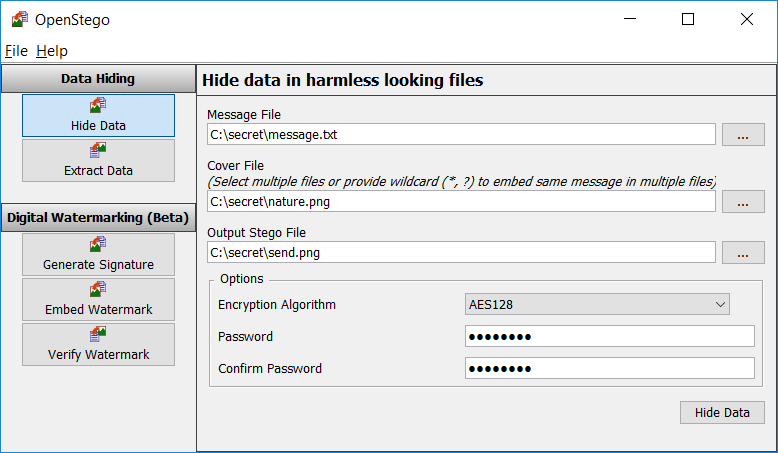
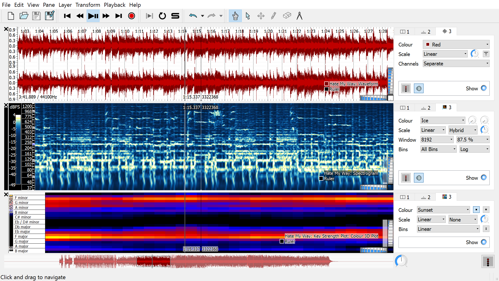

UAP-CTF
===============

> Khan Janny | August 2022


Steganography
---------------------

* [Stegsolve.jar](http://www.caesum.com/handbook/Stegsolve.jar)

	A Java tool, that will open an image and let you as the user arrow through different renditions of the image (viewing color channels, inverted colors, and more). The tool is surprisingly useful.

	```
	wget http://www.caesum.com/handbook/Stegsolve.jar -O stegsolve.jar
	```

	


* [StegCracker](https://github.com/Paradoxis/StegCracker)

	Don't ever forget about [`steghide`][steghide]! This tool can use a password list like `rockyou.txt` with steghide. SOME IMAGES CAN HAVE MULTIPLE FILED ENCODED WITH MULTIPLE PASSWORDS.

	 


* [Steganography Online](http://stylesuxx.github.io/steganography/)

	A tool often used in CTFs for encoding messages into images.

	

* [StegSeek](https://github.com/RickdeJager/stegseek)]

	This is similar to `stegcracker`, but _much_ faster. Can also extract metadata without a password list.

	

* [`steg_brute.py`](https://github.com/Va5c0/Steghide-Brute-Force-Tool)

	This is similar to `stegcracker` above.
	Execute a brute force attack with Steghide to file with hide information and password established.

* [openstego](https://www.openstego.com/)

	A [Java][Java] [`.JAR`][JAR] tool, that can extract data from an image. A good tool to use on guessing challenges, when you don't have any other leads. We found this tool after the [Misc50](http://0xahmed.ninja/nullcon-hackim18-ctf-writeups/) challenge from [HackIM 2018](https://ctftime.org/event/566)

	


* [`steghide`](http://steghide.sourceforge.net/)

	A command-line tool typically used alongside a password or key, that could be uncovered some other way when solving a challenge.

	```
	sudo apt install steghide
	```

* [stepic](http://domnit.org/stepic/doc/)

	Python image steganography. Stepic hides arbitrary data inside PIL images. Download it here: http://domnit.org/stepic/doc/

* [Digital Invisible Ink Stego Tool](http://diit.sourceforge.net/)

	A Java steganography tool that can hide any sort of file inside a digital image (regarding that the message will fit, and the image is 24 bit colour)

* [ImageHide](https://www.softpedia.com/get/Security/Encrypting/ImageHide.shtml)

	For PNG images (or BMP) images, there exists a Windows utility that can hide "ENCRYPTED" text within the LSB. If you also happen to have passwords, you can decrypt this and potentially find a flag. [https://www.softpedia.com/get/Security/Encrypting/ImageHide.shtml](https://www.softpedia.com/get/Security/Encrypting/ImageHide.shtml)

* [stegoVeritas](https://github.com/bannsec/stegoVeritas/)

	Another steganography tool. A simple command-line tool and super easy to use -- definitely one to at least try.


* [zsteg][(https://github.com/zed-0xff/zsteg)]

	Command-line tool for use against Least Significant Bit steganography... unfortunately only works against PNG and BMP images.

	```
	gem install zsteg
	```

* [jsteg](https://github.com/lukechampine/jsteg)

    Another command-line tool to use against JPEG images. [https://github.com/lukechampine/jsteg](https://github.com/lukechampine/jsteg) Handy for Hackerrank Codefest CTF 2018.

	```
	go get lukechampine.com/jsteg
	```

* [Jstego](https://sourceforge.net/projects/jstego/)

    A GUI tool for JPG steganography. [https://sourceforge.net/projects/jstego/](https://sourceforge.net/projects/jstego/) It is a [Java][Java] [JAR] file similar to stegsolve.jar

* [snow](http://www.darkside.com.au/snow/)

	A command-line tool for whitespace steganography (see above).

* [SONIC Visualizer](https://www.sonicvisualiser.org/)

	Some classic challenges use an audio file to hide a flag or other sensitive stuff. SONIC visualizer easily shows you [spectrogram](https://en.wikipedia.org/wiki/Spectrogram). __If it sounds like there is random bleeps and bloops in the sound, try this tactic!__

    


* [XIAO Steganography](https://xiao-steganography.en.softonic.com/)

	Being a Windows-specific tool, it is often used in CTFs to hide flags inside audio files. 
	Take a look if the challenge has some odd strings which might resemble passwords.


* [zbarimg](http://zbar.sourceforge.net/)

	A command-line tool to quickly scan multiple forms of barcodes, [QR codes] included. Installed like so on a typical [Ubuntu] image:

	```
	sudo apt install zbar-tools
	```


* Unicode Steganography / Zero-Width Space Characters

	Some text that may be trying to hide something, in a seemingly innocent way, like "Hmm, there may be something hiding here..." may include zero-width characters. This is a utility that might help: [https://330k.github.io/misc_tools/unicode_steganography.html](https://330k.github.io/misc_tools/unicode_steganography.html) ... Other options are just gross find and replace operations in Python IDLE.


* Online LSB Tools

	There are many online LSB tools that work in different ways. If you are given a file that you know is part of a Least Significant Bit challenge, try these tools:

	[https://manytools.org/hacker-tools/steganography-encode-text-into-image/](https://manytools.org/hacker-tools/steganography-encode-text-into-image/) Only supports PNG
	[https://stylesuxx.github.io/steganography/](https://stylesuxx.github.io/steganography/)


* Morse Code

	Always test for this if you are seeing two distinct values... _it may not always be binary!_ Online decoders like so: [https://morsecode.scphillips.com/translator.html](https://morsecode.scphillips.com/translator.html). If you need to be case-sensistive or include a bit more stuff like numbers and punctuation, use this code: [https://gist.github.com/JohnHammond/961acabfd85a8715220fa79492b25368](https://gist.github.com/JohnHammond/961acabfd85a8715220fa79492b25368)

	If you find Morsecode in the "international written form", like "dah-dit-dit-dah" etcetera, you can use this code: [https://gist.github.com/JohnHammond/7d3ddb167fa56f139dc4419091237b51](https://gist.github.com/JohnHammond/7d3ddb167fa56f139dc4419091237b51) ... which was carved out of this resource: [https://morsecode.scphillips.com/morse.html](https://morsecode.scphillips.com/morse.html)


* [Whitespace](https://tio.run/#whitespace)

	Tabs and spaces could be representing 1's and 0's and treating them as a binary message... or, they could be whitespace done with [`snow`][snow] or an esoteric programming language interpreter: [https://tio.run/#whitespace](https://tio.run/#whitespace)


* Audio Speed Change (also change pitch)

	```
	mplayer -af scaletempo -speed 64 flag.mp3
	```


* Extract Thumbnail (data is covered in original image)

	If you have an image where the data you need is covered, try viewing the thumbnail:

	```
	exiftool -b -ThumbnailImage my_image.jpg > my_thumbnail.jpg
	```


* [Detect DTMF Tones]

	Audio frequencies common to a phone button, DTMF: [https://en.wikipedia.org/wiki/Dual-tone_multi-frequency_signaling](https://en.wikipedia.org/wiki/Dual-tone_multi-frequency_signaling).


* Phone-Keypad

	Some messages may be hidden with a string of numbers, but really be encoded with old cell-phone keypads, like text messaging with numbers repeated:


* [QR code]

	A small square "barcode" image that holds data.
	Online Solver 


* Punctuation marks `!`, `.` and `?`

	I have seen some challenges use just the end of `.` or `?` or `!` to represent the [Ook](http://esolangs.org/wiki/ook!) esoteric programming language. Don't forget that is a thing!


* DNA Codes

    When given a sequence with only A, C, G, T , there is an online mapping for these. Try this:

    

    


* Other stego tools:

	[https://github.com/DominicBreuker/stego-toolkit](https://github.com/DominicBreuker/stego-toolkit)
