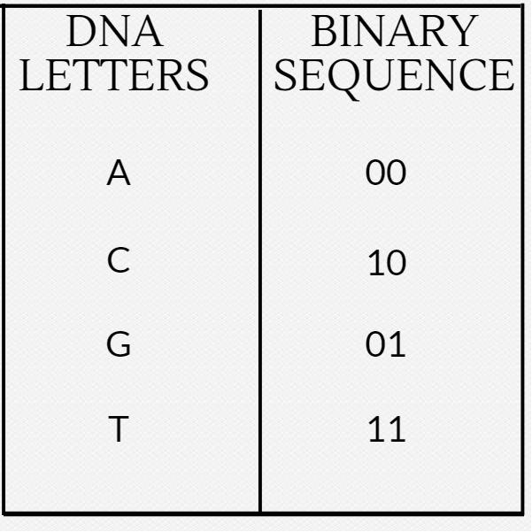
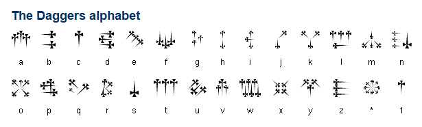

UAP-CTF
===============

> Khan Janny | August 2022


Steganography
---------------------

* [StegCracker](https://github.com/Paradoxis/StegCracker)

	Don't ever forget about [`steghide`][steghide]! This tool can use a password list like `rockyou.txt` with steghide. SOME IMAGES CAN HAVE MULTIPLE FILED ENCODED WITH MULTIPLE PASSWORDS.

	 


* [Steganography Online](http://stylesuxx.github.io/steganography/)

	A tool often used in CTFs for encoding messages into images.

* [StegSeek](https://github.com/RickdeJager/stegseek)]

	This is similar to `stegcracker`, but _much_ faster. Can also extract metadata without a password list.

* [`steg_brute.py`](https://github.com/Va5c0/Steghide-Brute-Force-Tool)

	This is similar to `stegcracker` above.

* [openstego](https://www.openstego.com/)

	A [Java][Java] [`.JAR`][JAR] tool, that can extract data from an image. A good tool to use on guessing challenges, when you don't have any other leads. We found this tool after the [Misc50](http://0xahmed.ninja/nullcon-hackim18-ctf-writeups/) challenge from [HackIM 2018](https://ctftime.org/event/566)

* [`Stegsolve.jar`][Stegsolve.jar]

	A [Java][Java] [`.JAR`][JAR] tool, that will open an image and let you as the user arrow through different renditions of the image (viewing color channels, inverted colors, and more). The tool is surprisingly useful.

* [`steghide`][steghide]

	A command-line tool typically used alongside a password or key, that could be uncovered some other way when solving a challenge.

* [`stepic`](http://domnit.org/stepic/doc/)

	Python image steganography. Stepic hides arbitrary data inside PIL images. Download it here: http://domnit.org/stepic/doc/

* [Digital Invisible Ink Stego Tool](http://diit.sourceforge.net/)

	A Java steganography tool that can hide any sort of file inside a digital image (regarding that the message will fit, and the image is 24 bit colour)

# WHEN GIVEN A FILE TO WORK WITH, DO NOT FORGET TO RUN THIS STEGHIDE WITH AN EMPTY PASSWORD!

* [ImageHide](https://www.softpedia.com/get/Security/Encrypting/ImageHide.shtml)

	For PNG images (or BMP) images, there exists a Windows utility that can hide "ENCRYPTED" text within the LSB. If you also happen to have passwords, you can decrypt this and potentially find a flag. [https://www.softpedia.com/get/Security/Encrypting/ImageHide.shtml](https://www.softpedia.com/get/Security/Encrypting/ImageHide.shtml)

* [stegoVeritas](https://github.com/bannsec/stegoVeritas/)

	Another steganography tool. A simple command-line tool and super easy to use -- definitely one to at least try.

* Unicode Steganography / Zero-Width Space Characters

	Some text that may be trying to hide something, in a seemingly innocent way, like "Hmm, there may be something hiding here..." may include zero-width characters. This is a utility that might help: [https://330k.github.io/misc_tools/unicode_steganography.html](https://330k.github.io/misc_tools/unicode_steganography.html) ... Other options are just gross find and replace operations in Python IDLE.

* Online LSB Tools

	There are many online LSB tools that work in different ways. If you are given a file that you know is part of a Least Significant Bit challenge, try these tools:

	[https://manytools.org/hacker-tools/steganography-encode-text-into-image/](https://manytools.org/hacker-tools/steganography-encode-text-into-image/) Only supports PNG
	[https://stylesuxx.github.io/steganography/](https://stylesuxx.github.io/steganography/)

* Other stego tools:

	[https://github.com/DominicBreuker/stego-toolkit](https://github.com/DominicBreuker/stego-toolkit)

* [`zsteg`][zsteg]

	Command-line tool for use against Least Significant Bit steganography... unfortunately only works against PNG and BMP images.

* [`jsteg`][jsteg]

    Another command-line tool to use against JPEG images. [https://github.com/lukechampine/jsteg](https://github.com/lukechampine/jsteg) Handy for Hackerrank Codefest CTF 2018.

* [Jstego][Jstego]

    A GUI tool for JPG steganography. [https://sourceforge.net/projects/jstego/](https://sourceforge.net/projects/jstego/) It is a [Java][Java] [JAR] file similar to stegsolve.jar

* Morse Code

	Always test for this if you are seeing two distinct values... _it may not always be binary!_ Online decoders like so: [https://morsecode.scphillips.com/translator.html](https://morsecode.scphillips.com/translator.html). If you need to be case-sensistive or include a bit more stuff like numbers and punctuation, use this code: [https://gist.github.com/JohnHammond/961acabfd85a8715220fa79492b25368](https://gist.github.com/JohnHammond/961acabfd85a8715220fa79492b25368)

	If you find Morsecode in the "international written form", like "dah-dit-dit-dah" etcetera, you can use this code: [https://gist.github.com/JohnHammond/7d3ddb167fa56f139dc4419091237b51](https://gist.github.com/JohnHammond/7d3ddb167fa56f139dc4419091237b51) ... which was carved out of this resource: [https://morsecode.scphillips.com/morse.html](https://morsecode.scphillips.com/morse.html)

* Whitespace

	Tabs and spaces could be representing 1's and 0's and treating them as a binary message... or, they could be whitespace done with [`snow`][snow] or an esoteric programming language interpreter: [https://tio.run/#whitespace](https://tio.run/#whitespace)

* Audio Speed Change (also change pitch)

```
mplayer -af scaletempo -speed 64 flag.mp3
```

* DNA Codes

    When given a sequence with only A, C, G, T , there is an online mapping for these. Try this:

    
    


* Extract Thumbnail (data is covered in original image)

	If you have an image where the data you need is covered, try viewing the thumbnail:

```
exiftool -b -ThumbnailImage my_image.jpg > my_thumbnail.jpg
```

* [`snow`][snow]

	A command-line tool for whitespace steganography (see above).

* SONIC Visualizer (audio spectrum)

	Some classic challenges use an audio file to hide a flag or other sensitive stuff. SONIC visualizer easily shows you [spectrogram](https://en.wikipedia.org/wiki/Spectrogram). __If it sounds like there is random bleeps and bloops in the sound, try this tactic!__

* [XIAO Steganography](https://xiao-steganography.en.softonic.com/)

	Being a Windows-specific tool, it is often used in CTFs to hide flags inside audio files. __Take a look if the challenge has some odd strings which might resemble passwords.__


* [Detect DTMF Tones]

	Audio frequencies common to a phone button, DTMF: [https://en.wikipedia.org/wiki/Dual-tone_multi-frequency_signaling](https://en.wikipedia.org/wiki/Dual-tone_multi-frequency_signaling).

* Phone-Keypad

	Some messages may be hidden with a string of numbers, but really be encoded with old cell-phone keypads, like text messaging with numbers repeated:


* [`hipshot`][hipshot]

	A [Python] module to compress a video into a single standalone image, simulating a long-exposure photograph. Was used to steal a [QR code] visible in a video, displayed through "Star Wars" style text motion.

* [QR code]

	A small square "barcode" image that holds data.

* [`zbarimg`][zbarimg]

	A command-line tool to quickly scan multiple forms of barcodes, [QR codes] included. Installed like so on a typical [Ubuntu] image:

```
sudo apt install zbar-tools
```

* Punctuation marks `!`, `.` and `?`

	I have seen some challenges use just the end of `.` or `?` or `!` to represent the [Ook](http://esolangs.org/wiki/ook!) esoteric programming language. Don't forget that is a thing!

Cryptography
-----------------

* Cryptii

	[https://cryptii.com](https://cryptii.com) has multiple decoding tools like base64, Ceaser Cipher, ROT13, Vigenère Cipher and more.
* Keyboard Shift

	[https://www.dcode.fr/keyboard-shift-cipher](https://www.dcode.fr/keyboard-shift-cipher) If you see any thing that has the shape of a sentence but it looks like nonsense letters, and notes some shift left or right, it may be a keyboard shift...

* Bit Shift

	Sometimes the letters may be shifted by a stated hint, like a binary bit shift ( x >> 1 ) or ( x << 1 ).

* Reversed Text

	Sometimes a "ciphertext" is just as easy as reversed text. Don't forgot to check under this rock! You can reverse a string in [Python] like so:

```
"UOYMORFEDIHOTGNIYRTEBTHGIMFTCA.TAHTTERCESASISIHT"[::-1]
```

* XOR

	ANY text could be XOR'd. Techniques for this are Trey's code, and XORing the data against the known flag format. Typically it is given in just hex, but once it is decoded into raw binary data, it gives it keeps it's hex form (as in `\xde\xad\xbe\xef` etc..) Note that you can do easy XOR locally with Python like so (you need `pwntools` installed):

	``` python
	python >>> import pwn; pwn.xor("KEY", "RAW_BINARY_CIPHER")
	```

# IF YOU KNOW A DECENT CRIB (PLAINTEXT), USE CYBERCHEF TO HELP DETERMINE THE KEY

# DO NOT FORGET TO JUST BRUTEFORCE JUST THE FIRST BYTE, OR TWO BYTES OR THREE BYTES.


* Caesar Cipher

	The most classic shift cipher. Tons of online tools like this: [https://www.dcode.fr/caesar-cipher](https://www.dcode.fr/caesar-cipher) or use `caesar` as a command-line tool (`sudo apt install bsdgames`) and you can supply a key for it. Here's a one liner to try all letter positions:

	```
	cipher='jeoi{geiwev_gmtliv_ws_svmkmrep}' ; for i in {0..25}; do echo $cipher | caesar $i; done
	```

	__Be aware!__ Some challenges include punctuation in their shift! If this is the case, try to a shift within all 255 ASCII characters, not just 26 alphabetical letters!

* `caesar`

	A command-line caesar cipher tool (noted above) found in the `bsdgames` package.

* [Atbash Cipher]

	If you have some text that you have no idea what it is, try the [Atbash cipher]! It's a letter mapping, but the alphabet is reversed: like `A` maps to `Z`, `B` maps to `Y` and so on. There are tons of online tools to do this ([http://rumkin.com/tools/cipher/atbash.php](http://rumkin.com/tools/cipher/atbash.php)), and you can build it with [Python].

* [Vigenere Cipher]

	[http://www.mygeocachingprofile.com/codebreaker.vigenerecipher.aspx](http://www.mygeocachingprofile.com/codebreaker.vigenerecipher.aspx), [https://www.guballa.de/vigenere-solver](https://www.guballa.de/vigenere-solver) and personal Python code here: [https://pastebin.com/2Vr29g6J](https://pastebin.com/2Vr29g6J)


* Gronsfeld Cipher

	A variant of the Vignere cipher that uses numbers insteads of letters. [http://rumkin.com/tools/cipher/gronsfeld.php](http://rumkin.com/tools/cipher/gronsfeld.php)

* Beaufourt Cipher

	[https://www.dcode.fr/beaufort-cipher](https://www.dcode.fr/beaufort-cipher)

* [Bacon Cipher](https://en.wikipedia.org/wiki/Bacon%27s_cipher)

	A substitution cipher that replaces each character with five characters from a set of two (A and B is used most of the time). If we look at A as 0 and B as 1 it is a special encoding to binary numbers, where the character A has the value of binary `b00000`. Easy to recognize, because the ciphertext only contains two characters (e.g.: A and B) and the length of the ciphertext is divisible by 5. Example: `AAABB AAABA ABBAB AAABB AABAA AAAAB AAAAA AAABA ABBAB ABBAA`.

        [Online tool](http://rumkin.com/tools/cipher/baconian.php)

* Python random module cracker/predictor

	[https://github.com/tna0y/Python-random-module-cracker](https://github.com/tna0y/Python-random-module-cracker)... helps attack the Mersenne Twister used in Python's random module.

* Transposition Cipher

* RSA: Classic RSA

	Variables typically given: `n`, `c`, `e`. _ALWAYS_ try and give to [http://factordb.com](http://factordb.com). If `p` and `q` are able to be determined, use some RSA decryptor; handmade code available here: [https://pastebin.com/ERAMhJ1v](https://pastebin.com/ERAMhJ1v)

* RSA: Multi-prime RSA

	When you see multi-prime RSA, you can use calculate `phi` by still using all the factors.

```
phi = (a - 1) * (b - 1) * (c - 1)    # ... etcetera
```

__If FactorDB cannot find factors, try alpertron: [https://www.alpertron.com.ar/ECM.HTM](https://www.alpertron.com.ar/ECM.HTM)__


* RSA: `e` is 3 (or small)

	If `e` is 3, you can try the cubed-root attack. If you the cubed root of `c`, and if that is smaller than the cubed root of `n`, then your plaintext message `m` is just the cubed root of `c`! Here is [Python] code to take the cubed root:

```
def root3rd(x):
    y, y1 = None, 2
    while y!=y1:
        y = y1
        y3 = y**3
        d = (2*y3+x)
        y1 = (y*(y3+2*x)+d//2)//d
    return y
```

* RSA: Wiener's Little D Attack

	The telltale sign for this kind of challenge is an enormously large `e` value. Typically `e` is either 65537 (0x10001) or `3` (like for a Chinese Remainder Theorem challenge). Some stolen code available here: [https://pastebin.com/VKjYsDqD](https://pastebin.com/VKjYsDqD)

* RSA:  Boneh-Durfee Attack
	The tellgate sign for this kind of challenge is also an enormously large `e` value (`e` and `n` have similar size).
Some code for this attack can be found [here](https://github.com/mimoo/RSA-and-LLL-attacks/blob/master/boneh_durfee.sage)

* RSA: Chinese Remainder Attack

	These challenges can be spotted when given  mutiple `c` cipher texts and multiple `n` moduli. `e` must be the same number of given `c` and `n` pairs. Some handmade code here: [https://pastebin.com/qypwc6wH](https://pastebin.com/qypwc6wH)

* [LC4]

	This is an adaptation of RC4... just not. There is an implementation available in Python.
	[https://github.com/dstein64/LC4/blob/master/documentation.md](https://github.com/dstein64/LC4/blob/master/documentation.md)

* Elgamal

* Affine Cipher

* Substitution Cipher (use quip quip!)

	[https://quipqiup.com/](https://quipqiup.com/)

* Railfence Cipher

	[http://rumkin.com/tools/cipher/railfence.php](http://rumkin.com/tools/cipher/railfence.php)


* [Playfair Cipher]

	racker: [http://bionsgadgets.appspot.com/ww_forms/playfair_ph_web_worker3.html](http://bionsgadgets.appspot.com/ww_forms/playfair_ph_web_worker3.html)

* Polybius Square

	[https://www.braingle.com/brainteasers/codes/polybius.php](https://www.braingle.com/brainteasers/codes/polybius.php)

* The Engima

	[http://enigma.louisedade.co.uk/enigma.html](http://enigma.louisedade.co.uk/enigma.html),
	[https://www.dcode.fr/enigma-machine-cipher](https://www.dcode.fr/enigma-machine-cipher)

* AES ECB

	The "blind SQL" of cryptography... leak the flag out by testing for characters just one byte away from the block length.


* Two-Time Pad

* [International Code of Signals Maritime]

	First drafted by the British Board of Trade in 1855 and adopted as a world-wide standard on 1 January 1901. It is used for communications with ships, but also occasionally used by geocaching mystery caches (puzzle caches), CTFs and various logic puzzles. You may want to give a look at the tool [maritime flags translator].


* Daggers Cipher

The daggers cipher is another silly text-to-image encoder. This is the key, and you can
find a decoder on [https://www.dcode.fr/daggers-alphabet](https://www.dcode.fr/daggers-alphabet).



* Hylian Language (Twilight Princess)

The Hylian language is another silly text-to-image encoder. This is the key, and you can
find a decoder on [https://www.dcode.fr/hylian-language-twilight-princess](https://www.dcode.fr/hylian-language-twilight-princess).


* Hylian Language (Breath of the Wild)

The Hylian language is another silly text-to-image encoder. This is the key, and you can
find a decoder on [https://www.dcode.fr/hylian-language-breath-of-the-wild](https://www.dcode.fr/hylian-language-breath-of-the-wild).


* Sheikah Language (Breathe of the Wild)

The Sheikah language is another silly text-to-image encoder. This is the key, and you can
find a decoder on [https://www.dcode.fr/sheikah-language](https://www.dcode.fr/sheikah-language).


* Hexahue Alphabet 

The hexhue is an another tex-to-image enocder. you can find a decoder
on [https://www.boxentriq.com/code-breaking/hexahue](https://www.boxentriq.com/code-breaking/hexahue)


